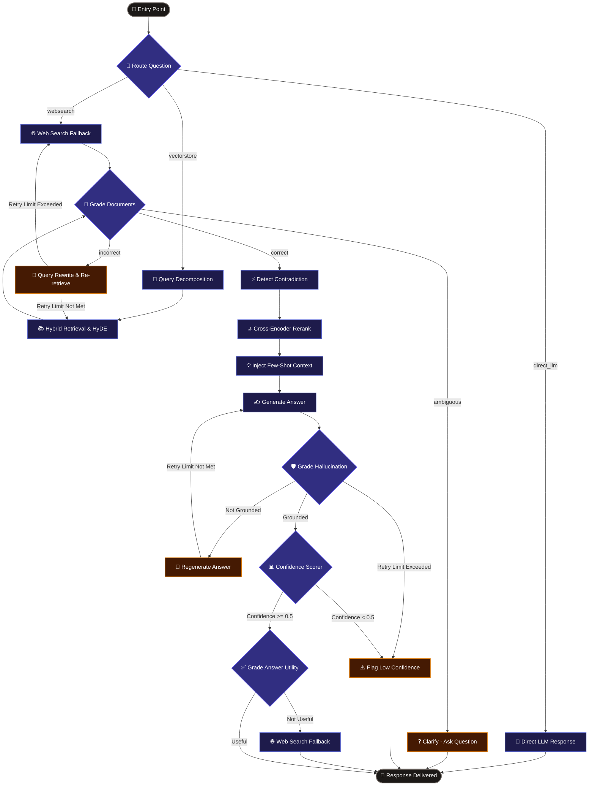

# 🧠 Ultimate Self-Correcting Agentic RAG Pipeline

[](https://python.org)
[](https://fastapi.tiangolo.com)
[](https://nextjs.org)
[](https://langchain.com)
[](https://opensource.org/licenses/MIT)

An enterprise-grade, production-ready **13-Stage Self-Correcting Agentic Retrieval-Augmented Generation (RAG)** engine built to handle **messy, unstructured, and multi-modal enterprise documents** (scanned PDFs with OCR, complex technical manuals, digital documents, and unstructured text).

Unlike legacy linear RAG systems that blindly trust top-k vector search and risk generating hallucinations, **Ultimate RAG** dynamically evaluates the quality, relevance, and consistency of retrieved context. It intelligently decides whether to **re-query**, **ask clarifying questions**, **detect contradictions**, **run cross-encoder reranking**, or **trigger web search fallbacks**.

---

## 🌟 Key Capabilities & Highlights

| Feature | Architectural Mechanism & Technical Details |
| :--- | :--- |
| 📄 **Robust Ingestion & OCR** | PyMuPDF loader for native PDFs with automatic PyTesseract fallback for scanned, image-only documents. Computes per-chunk extraction confidence. |
| 🔀 **Hybrid Retrieval & RRF** | Combines **BM25** (lexical keyword matching) with **Vector Search** (bge-m3 / Qdrant / ChromaDB 1024-dim dense embeddings) fused via Reciprocal Rank Fusion (RRF, $k=60$). |
| 🔮 **Hypothetical Document Embeddings (HyDE)** | Generates synthetic answer hypotheses to map user intent into document embedding space prior to vector search. |
| 🎯 **3-State CRAG Quality Grading** | Evaluates document context using a 3-tier policy: `correct`, `ambiguous`, or `incorrect`. |
| ❓ **Interactive Clarification Engine** | Surfaces explicit clarifying questions to the user when query context is inherently ambiguous. |
| ⚡ **Pairwise Contradiction Detection** | Analyzes top-ranked documents for conflicting statements and highlights discrepancies in response citations. |
| 🔄 **Self-Healing Re-Query Loop** | Automatically rewrites search queries and re-executes hybrid retrieval when context quality falls short (up to 3 iterations). |
| 🌐 **Adaptive Web Search Fallback** | Routes out-of-domain or unanswerable queries to web search APIs (Tavily) when local corpus is insufficient. |
| 🔍 **Cross-Encoder Reranking** | Re-scores hybrid retrieval candidates using NVIDIA / OpenRouter cross-encoders (`cross-encoder/ms-marco-MiniLM-L-6-v2`). |
| 🛡️ **Hallucination & Answer Graders** | Verifies generated responses against source context. Un-grounded statements trigger immediate answer regeneration. |
| 📈 **Dynamic Few-Shot Learning** | Captures user feedback (thumbs up/down) to dynamically retrieve past winning exemplars for future prompt construction. |
| 📊 **Evaluation Harness** | Built-in 12-scenario evaluation harness comparing baseline RAG vs. Ultimate Self-Correcting RAG across key quality metrics. |

---

## 🏗️ System Architecture

The entire RAG workflow is implemented as a state machine using **LangGraph**:



---

## 📁 Repository Structure

```
Ultimate-RAG/
├── api/
│   └── server.py                 # FastAPI application with SSE streaming endpoints
├── config.py                     # Centralized environment & model configuration
├── llm.py                        # Multi-provider LLM factory (Gemini, OpenRouter, NVIDIA)
├── main.py                       # CLI application entrypoint
├── ingestion/
│   ├── document_loader.py        # PDF, Image, PyTesseract OCR document ingestion
│   ├── parent_store.py           # SQLite parent chunk metadata store
│   ├── lifecycle_manager.py     # Document wipe & vector index lifecycle manager
│   └── pipeline.py               # Document ingestion pipeline orchestrator
├── retrieval/
│   ├── vector_store.py           # ChromaDB / Qdrant vector database wrapper
│   ├── bm25_retriever.py         # BM25 lexical retriever & persistent store
│   ├── hybrid_retriever.py       # Reciprocal Rank Fusion (RRF) algorithm
│   ├── hyde.py                   # Hypothetical Document Embedding (HyDE)
│   └── reranker.py               # Cross-encoder reranker
├── graph/
│   ├── state.py                  # LangGraph GraphState schema definition
│   ├── graph.py                  # Master graph compilation & node routing
│   ├── chains/                   # Query decomposition & dynamic few-shot learning
│   └── nodes/                    # 11 discrete graph nodes (retrieval, grading, generation)
├── evaluation/
│   ├── evaluator.py              # Self-correcting benchmark evaluation engine
│   ├── harness.py                # Comparative evaluation harness (Baseline vs. Ultimate)
│   └── test_questions.py         # 12 standardized evaluation test scenarios
├── frontend/                     # Modern Next.js 15 / React / Tailwind CSS Dashboard
│   ├── src/app/                  # App router pages (Chat, Upload, Evaluation Dashboard)
│   └── src/components/           # Modular UI components & graph visualization
├── documents/                    # Local document ingestion directory
├── requirements.txt              # Backend Python dependencies
├── .gitignore                    # Git tracking rules
└── README.md                     # Technical documentation
```

---

## ⚡ Quickstart & Local Setup

### 1. Prerequisites

- **Python**: `3.10` or higher
- **Node.js**: `18.x` or higher
- **Tesseract OCR**: Installed and available in PATH (for scanned document processing)

### 2. Environment Setup

Clone the repository and install backend dependencies:

```bash
git clone https://github.com/Subharup-31/Ultimate-RAG.git
cd Ultimate-RAG

# Create virtual environment
python -m venv .venv
source .venv/bin/activate  # On Windows: .venv\Scripts\activate

# Install Python requirements
pip install -r requirements.txt
```

Create a `.env` file from `.env.example`:

```bash
cp .env.example .env
```

Configure your environment variables in `.env`:

```env
GOOGLE_API_KEY=your_gemini_api_key
OPENROUTER_API_KEY=your_openrouter_api_key  # Optional
TAVILY_API_KEY=your_tavily_api_key          # Optional for web search
```

### 3. Generate Sample Documents & Ingest

```bash
# Generate 4 synthetic sample PDFs (including scanned and contradictory docs)
python main.py generate-docs

# Ingest documents into BM25 + Vector Stores
python main.py ingest
```

### 4. Running CLI Commands

```bash
# Execute a single factual query
python main.py query "What is HyDE and how does it improve retrieval precision?"

# Run the 12-question evaluation benchmark
python main.py evaluate
```

### 5. Launch Server & Frontend

**Backend Server (FastAPI):**
```bash
python main.py serve
# Server runs at http://localhost:8000
```

**Frontend Dashboard (Next.js):**
```bash
cd frontend
npm install
npm run dev
# Dashboard runs at http://localhost:3000
```

---

## 🧪 Evaluation Benchmark

The baseline vs. ultimate evaluation compares **Standard RAG** against **Ultimate Self-Correcting RAG** across 12 diverse query scenarios:

| Metric | Description | Target Direction |
| :--- | :--- | :---: |
| **Hallucination Rate** | Percentage of generated answers containing ungrounded claims | 📉 Reduced |
| **Answer Precision** | Percentage of answers that directly resolve user intent | 📈 Increased |
| **Self-Correction Rate** | Success rate of re-querying or clarification triggers | 📈 Increased |
| **Average Confidence** | Mean calculated response confidence score | 📈 Increased |
| **Clarification Rate** | Percentage of ambiguous queries triggering user clarification | 🎯 Calibrated |
| **Web Search Rate** | Percentage of out-of-domain queries routed to web search | 🎯 Calibrated |

---

## 🔌 API Specification

| Method | Endpoint | Purpose |
| :--- | :--- | :--- |
| `POST` | `/api/query` | Synchronous RAG query execution |
| `GET` | `/api/query/stream` | Server-Sent Events (SSE) live pipeline trace |
| `POST` | `/api/upload` | Multipart document ingestion |
| `DELETE` | `/api/documents` | Clear document corpus and vector indexes |
| `POST` | `/api/feedback` | Record thumbs up/down user feedback for few-shot learning |
| `GET` | `/api/statistics` | Retrieve index sizes and storage stats |
| `GET` | `/api/health` | Health check endpoint |

---

## 📜 License

Distributed under the **MIT License**. See `LICENSE` for more information.

---

<p align="center">Crafted with ❤️ by <a href="https://github.com/Subharup-31">Subharup Nandi</a></p>
